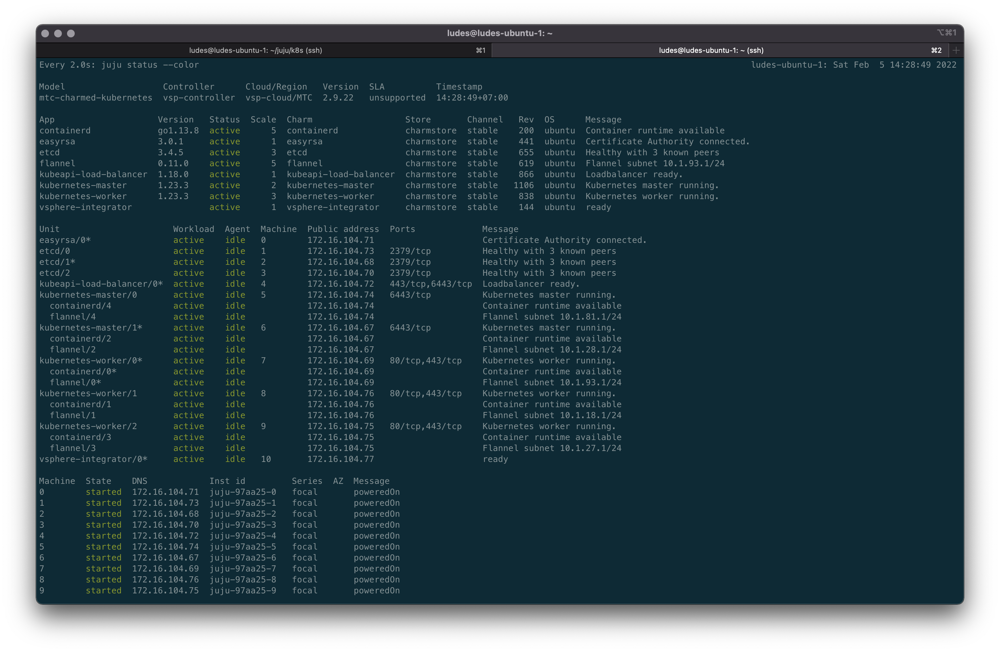
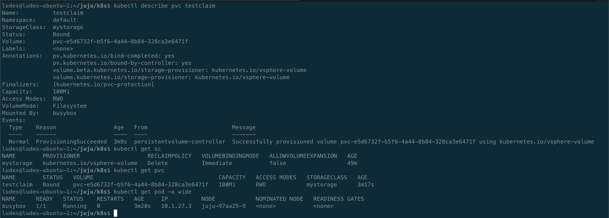
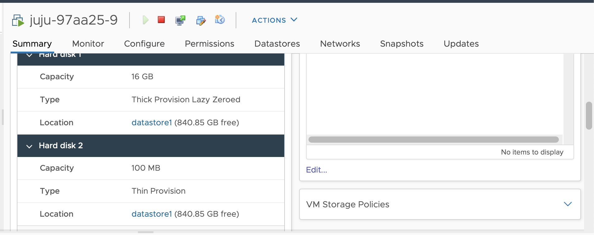

# **VSphere Charmed Kubernetes with Juju**
<p align="center">

</p>

### **How To**
1. Clone repo
```
git clone https://gitlab.com/FunGuardian/vsphere-charmed-kubernetes-juju.git
```
2. Change directory
```
cd vsphere-charmed-kubernetes-juju
```
3. Add Local Cloud [How to use VMware vSphere with Juju](https://juju.is/docs/olm/vmware-vsphere#heading--use-an-interactive-prompt)
```
juju add-cloud --local
```
> Snippet below only for reference, please update based on your environment
```
Cloud Types
  lxd
  maas
  manual
  openstack
  vsphere

Select cloud type: vsphere

Enter a name for your vsphere cloud: vsp-cloud

Enter the vCenter address or URL: 192.0.2.1

Enter datacenter name: dc0

Enter another datacenter? (y/N): y

Enter datacenter name: dc1

Enter another datacenter? (y/N): n

Cloud "vsp-cloud" successfully added

You will need to add credentials for this cloud (`juju add-credential vsp-cloud`)
before creating a controller (`juju bootstrap vsp-cloud`).
```
4. Add Credentials
```
juju add-credential vsp-cloud
```
> Snippet below only for reference, please update based on your environment
```
Enter credential name: vsp-cloud-creds

Using auth-type "userpass".

Enter user: jlaurin@juju.example.com

Enter password: ********

Enter vmfolder (optional): juju-root

Credential "vsp-cloud-creds" added locally for cloud "vsp-cloud".
```
5. Update model-default.yaml file based on your environment
> There is one more parameter **external-network** if you take a look documentation [How to use VMware vSphere with Juju](https://juju.is/docs/olm/vmware-vsphere#heading--vmware-specific-bootstrapping-options)
```
primary-network: MTC - VM Network - 50 
datastore: datastore1 
```
6. Execute bootstrap script to create controller, it will take a while
```
./bootstrap_controller.sh
```
7. Execute deploy script to create model, it will take a while
```
./juju_deploy.sh
```
8. You can monitor with command below
```
watch -c juju status --color
```
> **Happy Waiting**
##### **Expected Result**

### **Accessing Cluster**
1. Copy kubeconfig
```
juju scp kubernetes-master/0:config ~/.kube/config
```
2. Check kube-system pod
```
3. You can take a look inside folder k8s for testing Persistent Volume
kubectl get pods -n kube-system
```
### **Persistent Volume Additional Config**
1. Additional config for my environment. [Charmed Kubernetes on vSphere](https://ubuntu.com/kubernetes/docs/vsphere-integration)
```
juju config vsphere-integrator folder='Ludes' 
```
### **Testing Persistent Volume**
1. Change directory to k8s
```
cd k8s
```
2. Create storage class
```
kubectl apply -f sc.yaml
```
3. Create persistent volume claim
```
kubectl apply -f pvc.yaml
```
4. Create pod
```
kubectl apply -f pod.yaml
```
##### **Result**

  
### **Sources**
1. [How to use VMware vSphere with Juju](https://juju.is/docs/olm/vmware-vsphere)
2. [Charmed Kubernetes on vSphere](https://ubuntu.com/kubernetes/docs/vsphere-integration)
3. [Github Issue](https://github.com/rancher/rancher/issues/18949) 
4. [Github vSphere Cloud Provider](https://github.com/kubernetes/cloud-provider-vsphere/tree/master/releases)
5. [VMware Doc vSphere Cloud Provider](https://docs.vmware.com/en/VMware-vSphere-Container-Storage-Plug-in/2.0/vmware-vsphere-csp-getting-started/GUID-0C202FC5-F973-4D24-B383-DDA27DA49BFA.html)
6. [Kubernetes Storage Classes](https://kubernetes.io/docs/concepts/storage/storage-classes/#vsphere)
